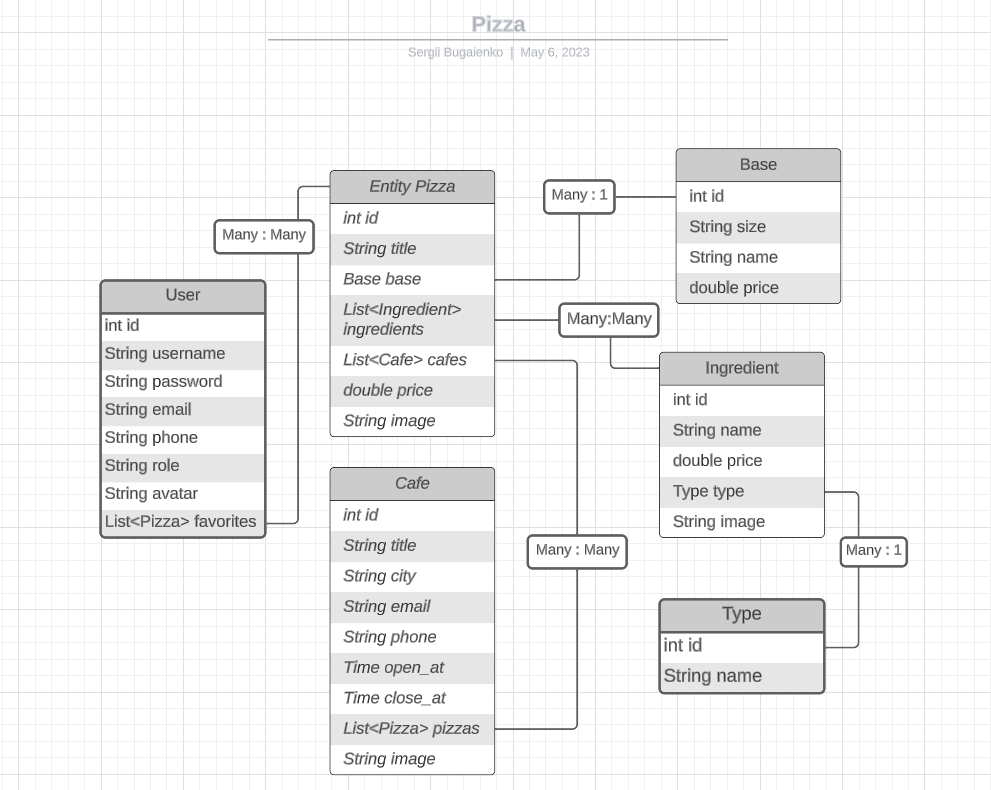

# A pat-project for a pizzeria chain website with the possibility of administration

## Implemented web-presentation for visitors and administrator.
## Also implemented REST API. The availability of the methods is limited depending on the status of the authorized user (user or admin).

### The working version of the project is [available at](http://serg-bug.info/)
### Full [documentation](https://bugaienko.github.io/javaDocsForPizza/) is available here 

#### The entities and their relationships are depicted in the diagram below

### An unauthorized user can:
* View general menu 
* See list of cafes 
* Menu of a cafe
* Sign up 
* Sign in

### An authorized user can:
* View general menu 
* See list of cafes 
* View the composition of each pizza 
* Menu of a cafe 
* Which café's menu has a specific pizza 
* Form a list of your favorite pizzas (*add, remove from the list, see the list in your personal cabinet*)

### A user with administrator status can:
* All functions of an authorized user + 
* Create a new pizza
* Edit pizza menu 
* Edit pizza price 
* Edit or create a new ingredient 
* Edit or create a new pizza base (*the entity determining the size and type of the pizza dough*)
* Edit cafe menu (*remove/add pizzas*)
* Edit or add a new ingredient type (*for example tomatoes have a "vegetable" type*)
* Add a new cafe or edit information about an existing one

### The following tools and techniques were used in the project:
* JAVA
* Spring BOOT
* SPRING SECURITY
* JWT-token AUTHORIZATION
* SPRING MVC
* LIQUIBASE
* POSTGRESQL
* SPRING DATA JPA
* THYMELEAF
* HTML
* CSS
* REST API
* SWAGGER
* OPEN API
* JSON
* YAML
* JUNIT5 JUPITER
* MAVEN
* GITHUB
* DOCKER
* DOCKER-COMPOSE

